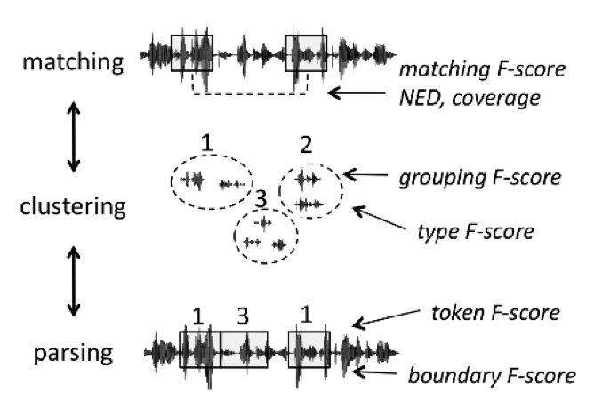

.. _0_evaluation_metrics:

Evaluation Metrics
~~~~~~~~~~~~~~~~~~

The metrics described in this section come from 
https://core.ac.uk/download/pdf/48187287.pdf.

Spoken term discovery can be logically broken down into a series of 3
operations, which can be all evaluated independently (see :ref:`Figure
1 <term_discovery_2015>`). The first step consists in matching pairs of
stretches of speech on the basis of their global similarity. The
second step consists in clustering the matching pairs, thereby
building a library of classes with potentially many instances. This is
equivalent to building a lexicon. In the third step, the system can
use its acquired classes to parse the continuous stream into candidate
tokens and boundaries. Some systems may only implement some of these
steps, others may do them simultaneously rather than sequentially. The
metric below have been devised to enable comparisons between these
different systems by evaluating separately these logically distinct
steps.

   **Figure 1.** term discovery principles

All of our metric assume a time aligned transcription, where
:math:`T_{i,j}` is the (phoneme) transcription corresponding to the
speech fragment designed by the pair of indices :math:`\langle i,j
\rangle` (i.e., the speech fragment between frame *i* and *j*). If the
left or right edge of the fragment contains part of a phoneme, that
phoneme is included in the transcription if is corresponds to more
than more than 30ms or more than 50% of it's duration.

